# SAWARI — Frontend

A women-safety-first ride-sharing web application built with React.js.
**SAWARI** is a **women-focused safety application** designed to provide a secure and empowering platform for women. This React-based frontend application serves as the user interface for accessing various safety features including SOS alerts, ride sharing, and community safety reporting.

### 🎓 Academic Context
- **Project:** [Sawari]
- **Institution:** [JSPM University]
- **Project Type:** Academic Project
- **Semester:** [5th-6th]

## Screenshots

### Landing Page
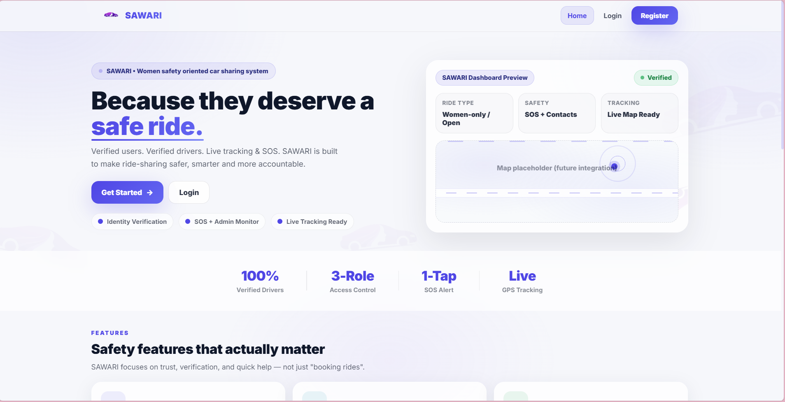

### Login
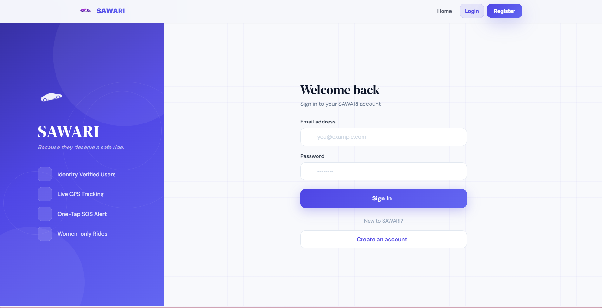

### Register
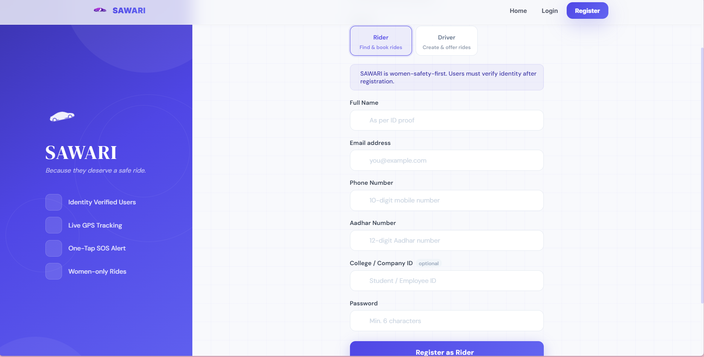

### User Dashboard
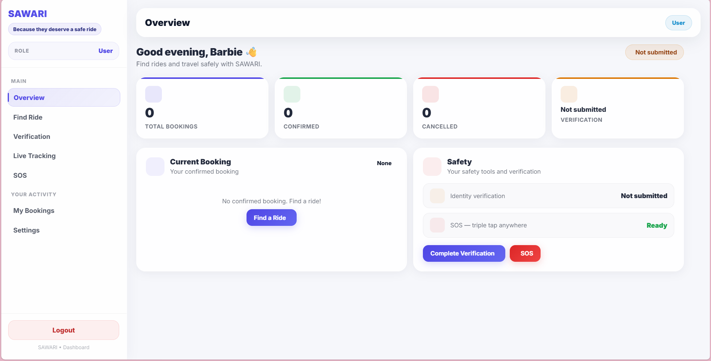

### Find Ride
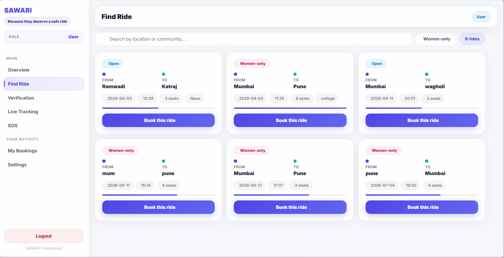

### Bookings
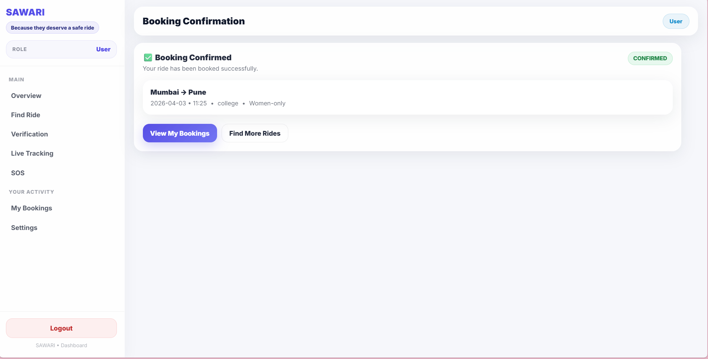

### SOS
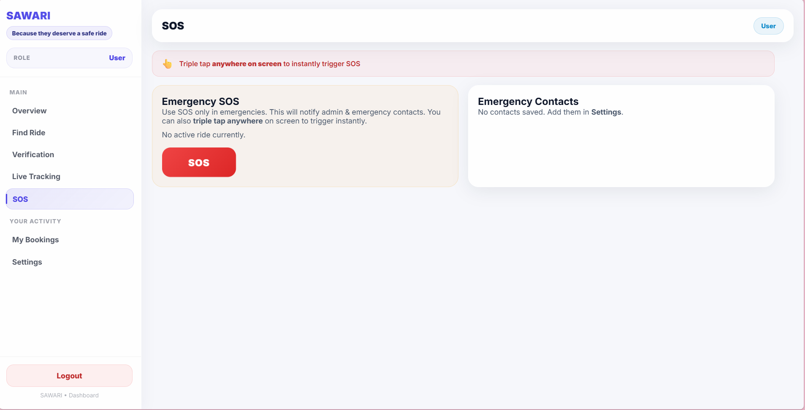

### Create Ride (Driver)
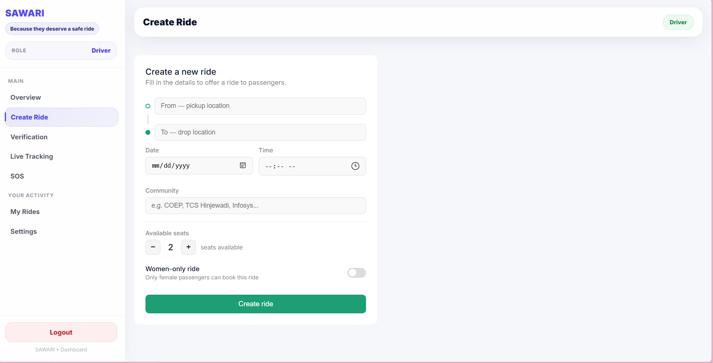

### My Rides (Driver)
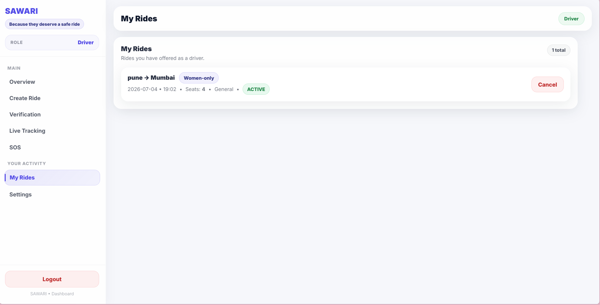

### Admin SOS
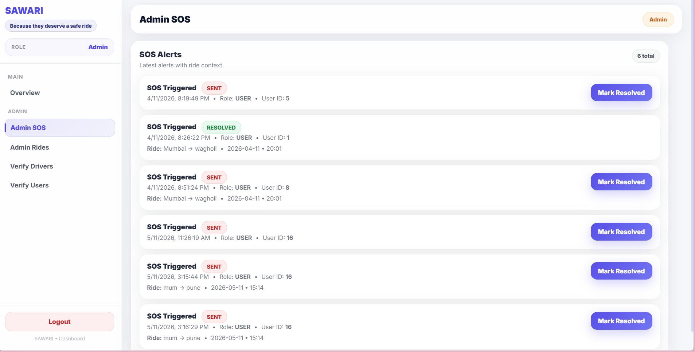

### Admin Verification
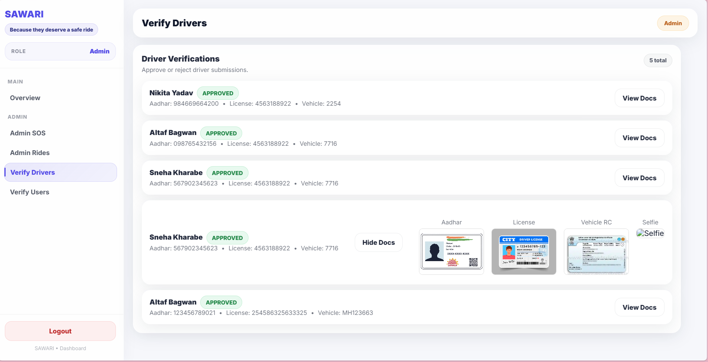

---

## Features

### Passenger (USER)
- Browse and book active rides
- Filter women-only rides
- View and cancel bookings
- Submit identity verification (Aadhar + College/Company ID)
- Trigger SOS alerts with a triple-tap gesture
- View personal SOS history

### Driver
- Create rides with route, seats, date/time, and women-only toggle
- Manage, cancel, and complete their own rides
- Submit driver verification documents (License, Vehicle RC, Aadhar, Selfie)
- View passenger bookings for each ride

### Admin
- View and resolve all SOS alerts
- Approve or reject driver and user verification documents
- Monitor all rides and users across the platform

---

## Tech Stack

| Technology | Purpose |
|---|---|
| React.js | UI framework |
| React Router v6 | Client-side routing |
| CSS (className-based) | Styling |
| Tabler Icons | Icon library |
| localStorage | Session management |
| Fetch API | HTTP requests to backend |

---

## Project Structure

```
src/
├── assets/              # Logo and static images
├── components/
│   ├── Navbar.js
│   ├── DashboardLayout.js
│   └── ProtectedRoute.js
├── pages/
│   ├── Landing.js
│   ├── Login.js
│   ├── Register.js
│   ├── Dashboard.js
│   └── dashboard/
│       ├── FindRide.js
│       ├── CreateRide.js
│       ├── Bookings.js
│       ├── MyRides.js
│       ├── Verification.js
│       ├── SOS.js
│       ├── LiveTracking.js
│       ├── Settings.js
│       ├── AdminSOS.js
│       ├── AdminVerification.js
│       ├── AdminUsersVerification.js
│       └── AdminRides.js
├── styles/              # Page-level CSS files
└── App.js               # Route definitions
```

---

## Role-Based Access

| Route | USER | DRIVER | ADMIN |
|---|---|---|---|
| `/dashboard` | Yes | Yes | Yes |
| `/dashboard/find-ride` | Yes | No | No |
| `/dashboard/bookings` | Yes | No | No |
| `/dashboard/create-ride` | No | Yes | No |
| `/dashboard/my-rides` | No | Yes | No |
| `/dashboard/admin-sos` | No | No | Yes |
| `/dashboard/admin-verification` | No | No | Yes |

---

### Installation

```bash
git clone https://github.com/Jyotimirgale25/sawari-frontend.git
cd sawari-frontend
npm install
npm start
```

App runs at **http://localhost:3000**

---
